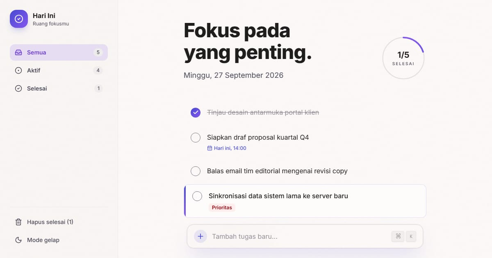

# Hari Ini — Satu daftar untuk satu hari

Daftar tugas yang sengaja hanya untuk hari ini. Yang selesai pindah ke rekap besoknya; yang belum selesai ikut terbawa dengan tanda "terbawa N hari". Editorial: judul serif miring, cincin progres bergradien, bilah tambah mengambang.

**Demo live:** https://todo-classic.vercel.app



> Data tersimpan di `localStorage` peramban — tanpa akun dan tanpa server. Kunjungan pertama diisi data contoh yang tanggalnya relatif terhadap hari ini; tanggal dan jam dihitung dalam WIB.

## Fitur

- Bilah tambah memahami jam dan prioritas: `Telepon klien 14.00 !` → jam 14.00, prioritas; pratinjau tampil sebelum disimpan. Ctrl/⌘ + K untuk fokus.
- Jam yang sudah lewat (WIB) ditandai; tugas terbawa ditandai jumlah harinya.
- Ubah teks (klik ganda atau tombol), tandai prioritas, hapus dengan "urungkan".
- `/rekap` — tugas selesai per hari selama 7 hari, streak, dan daftar per hari.
- `/panduan` — sintaks bilah tambah, pintasan, dan cara kerja.
- Mode terang & gelap.

## Halaman

`/` · `/panduan` · `/rekap`

## Teknologi

- Next.js 15.5 (App Router) dan React 19
- Tailwind CSS v4 (token tema + `.dark`)
- JavaScript
- Lucide (ikon)
- Font: Instrument Serif (judul), Inter (next/font)
- SEO: metadata per halaman, Open Graph, JSON-LD, sitemap.xml, dan robots.txt

## Menjalankan secara lokal

```bash
npm install
npm run dev
```

Buka http://localhost:3000. Untuk build produksi: `npm run build` lalu `npm start`.

---

Bagian dari koleksi 3 aplikasi daftar tugas di [PortalTodo](https://www.pintuweb.com/aplikasi-to-do). Dibuat oleh [PintuWeb](https://www.pintuweb.com), jasa pembuatan website.
